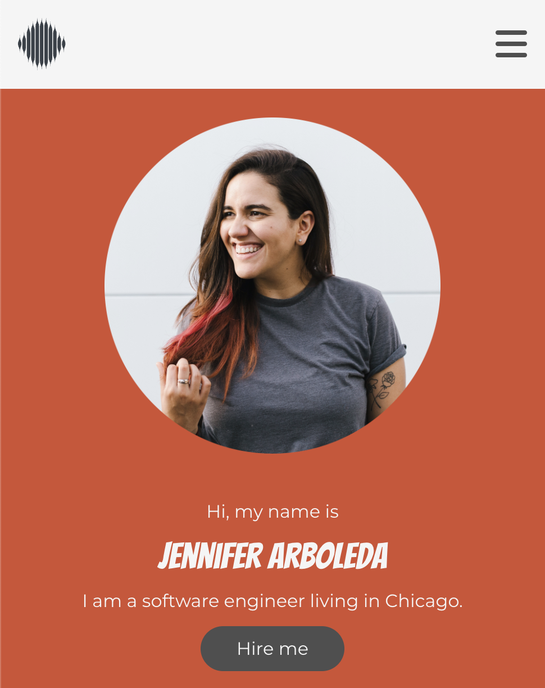
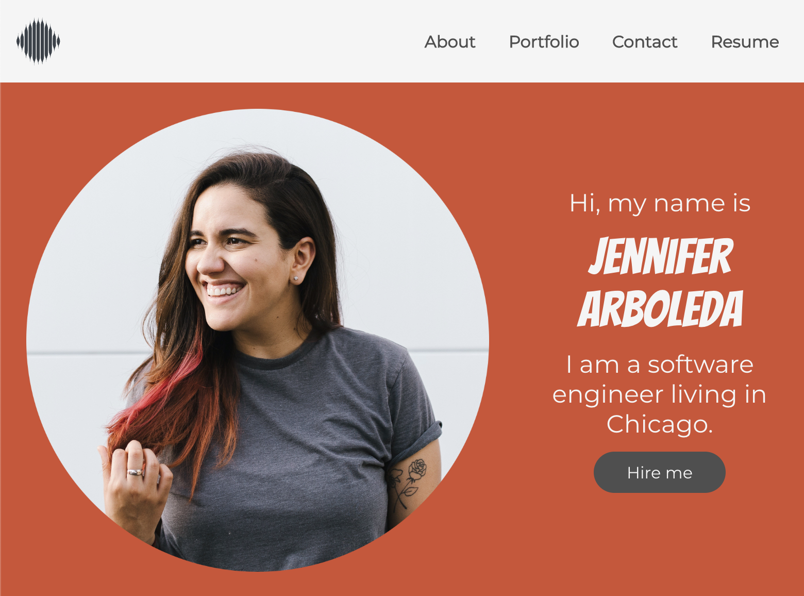

# Porfolio Slay

  ## Description
  This fully-responsive React app displays a portfolio of a Junior Web developer.

  The application allows its user to navigate through the Junior Dev's bio and portfolio. It also allows a user to contact the dev via email and download a PDF of their resume.

  ## Table of Contents
  * [Usage](#usage)
  * [License](#license)
  * [Questions](#questions)

  ## Getting Started

  ## Usage

  ### App Functionality

  Visit deployed site here: [Porfolio Slay](https://internetjen.github.io/portfolio-slay/)

  The site is fully responsive and accessible on all screens.

  
  

  ## License
  N/A

  ## Questions
  For inquiries, please email me at arboleda.jen@gmail.com or visit my [GitHub](https://github.com/internetjen)
